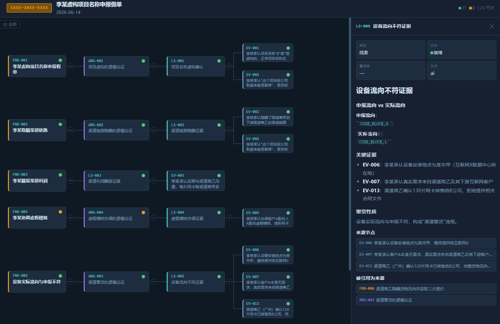

# 证据链管理 — 个人工作手册

面向：正在使用 evidence-management 技能登记证据、管理证据链、编制底稿的调查员。
目的：自己看的速查手册。理解证据管理流程、掌握证据链可视化方法、用好节点推理体系。

***

## 一、关于证据管理，记住这三句

1. **证据是调查的命脉。** 没有证据链的发现只是猜测。本技能管理"从原始证据到可呈堂底稿"的全生命周期。
2. **证据链可视化不是装饰，是推理工具。** 把 20+ 个节点（证据→线索→论据→事实认定）的关系画成一张图，一眼看清：推理是否跳跃？是否有单点支撑？是否有矛盾未排除？
3. **你的案件数据驱动你的证据链。** 登记数据 → AI 自动生成推理节点 → 你审阅修正 → 可视化刷新。闭环在几分钟内完成。

***

## 二、证据链可视化互动工具

`examples/` 目录下提供了一个**可直接使用的 HTML 证据链可视化模板**，以及对应的效果截图。



**可交互的文件位置：**

| 文件                                     | 说明         | 用途                      |
| -------------------------------------- | ---------- | ----------------------- |
| `examples/example_evidence_chain.html` | 完整的可视化互动页面 | ✅ **核心交付物** — 可直接用浏览器打开 |

### 2.1 怎么用

**不需要手动替换数据。** 证据链 HTML 由 AI 在调查过程中根据登记的证据数据自动生成。

你只需：

1. 在调查推进中向 AI 描述案情、登记证据（通过 `/evidence` 命令或直接对话）
2. 告诉 AI：**"根据当前 evidence_registry.json 和 nodes/ 数据，生成一份证据链可视化 HTML"**
3. AI 自动读取你的案件数据，输出一份完整的 HTML 文件到你的案件目录
4. 用浏览器打开 HTML，交互式审视推理链路

**在 HTML 中可以做什么：**

- 点击任意节点 → 右侧面板展示详细内容（来源、置信度、关联节点 excerpt）
- 折叠/展开推理分支 → 聚焦某一特定路径
- 追踪完整推理链 → 从 EV（证据）→ LS（线索）→ ARG（论据）→ FND（事实认定）一路向右到左
- 点击 source 引用 → 跳转到对应上下游节点

**示例文件 `examples/example_evidence_chain.html` 是生成结果的演示样本**，供你预览效果和了解输出格式。真实案件中的 HTML 由 AI 根据你的数据实时生成。

### 2.2 与 AI 互动修正

你打开浏览器审视可视化后，可以回到对话中指给 AI 看：

> 图上的 FND-001 到 ARG-002 这条线推理跳了一步，中间缺了渠道商甲的确认证据。帮我补充一个 LS 节点，关联到 EV-005 和 EV-006。

AI 会：

1. 读取你的 NODES\_DATA（你给它看文件的 script 内容，或描述你看到了什么）
2. 创建新节点或修改现有节点
3. 更新关系（`derived_from`、`supports`、`contradicts`）
4. 刷新可视化数据

**典型协作流程：**

```
你：打开 HTML 浏览证据链
你：(发现某条线不完整) → "EV-003 到 ARG-001 这条支撑关系太弱，还需要什么补充？"
AI：建议补充调证数据，创建 LS-004 节点
你：同意 → AI 修改 NODES_DATA → 你刷新浏览器 → 链更新
```

### 2.3 可视化之于证据链的核心价值

| 可以做什么    | 对应证据管理操作                       |
| -------- | ------------------------------ |
| 全局审视推理链路 | 一眼看出哪些 FND 只有单条 ARG 支撑（薄弱环节）   |
| 检查逻辑跳跃   | EV → FND 直接跳级？中间缺了 LS 或 ARG 节点 |
| 发现矛盾未处理  | 两条指向相反的 LS 是否都在 active 状态？     |
| 审查覆盖率    | 关键证据是否都被引用了？是否有孤点 EV 未关联任何推论？  |
| 汇报交流     | 截屏直接贴入报告第 7 章（事实认定可视化部分）       |

***

## 三、证据管理全生命周期速览

```
识别 → 收集 → 保全 → 记录 → 分析 → 保管 → 呈现 → 归档/移交
```

各阶段的技能支持：

| 阶段    | 做什么                         | 用哪个                      |
| ----- | --------------------------- | ------------------------ |
| 识别与收集 | 发现线索、调取文档、提取电子证据            | `evidence-management` 技能 |
| 保全    | 哈希校验、封装标记、环境控制              | SKILL.md 保管链规范           |
| 记录    | 登记到 evidence\_registry.json | `/evidence` 命令           |
| 分析    | 创建 LS → ARG → FND 推理节点      | AI 配合你的指令完成              |
| 呈现    | 生成可视化 HTML、截屏入报告            | `examples/` 模板 + 浏览器     |
| 归档    | 底稿复核、冻结节点、封卷                | `case-manager` 代理        |

### 典型工作流

```
线索 → fraud-classification 分类
     → investigation-planner 设计方案
         → 收集证据 → 登记 EV 节点
             → evidence-analyzer 分析 → 创建 LS → ARG
                 → 生成证据链 HTML 可视化
                     → 你审阅 → AI 迭代修正
             → FND 事实认定
         → report-writer 输出报告（含可视化截屏）
```

***

## 四、节点类型速记表

这是证据链推理体系的"积木块"——理解它们才能看懂可视化图中的颜色和层级。

| 前缀     | 类型              | 可视化颜色        | 层级     | 一句话             |
| ------ | --------------- | ------------ | ------ | --------------- |
| `EV-`  | 证据 (Evidence)   | 蓝色 `#7a9bb5` | L4 最底层 | 原始材料：说了什么、记录了什么 |
| `LS-`  | 线索 (Clue)       | 青色 `#4ecdc4` | L3     | 从证据里提炼出什么       |
| `ARG-` | 论据 (Argument)   | 紫色 `#9b7ae8` | L2     | 这些线索一起能证明什么     |
| `FND-` | 事实认定 (Finding)  | 金色 `#e8a020` | L1 顶层  | 最终认定的事实         |
| `ENT-` | 实体 (Entity)     | 灰蓝           | —      | 涉案的人和物          |
| `HYP-` | 假设 (Hypothesis) | 橙色           | —      | 竞争假设，驱动调查方向     |
| `EVT-` | 事件 (Event)      | 绿色           | —      | 时间线上的行为点        |

可视化图中，**越靠近左侧越接近结论（FND）**，越靠近右侧越接近原始证据（EV）。推理是从右到左发生的。

***

## 五、与 AI 协作的技巧

### 开案时

> 我刚登记了 5 条证据到 evidence\_registry.json，帮我根据这些 EV 创建初始的 LS 分析节点，并生成一份证据链 HTML。

### 审视图发现缺口时

> 图中 FND-002 的支撑链只有 ARG-001 一条线，太薄弱。EV-004 还挂在旁边没用上，能创建一条新的推理路径把它连进来吗？

### 需要推理把关时

> 检查一下我这张图里有没有逻辑跳跃——即 EV 直接支撑 FND 而没有经过 LS/ARG 中转的情况。

### 准备汇报时

> 帮我聚焦到 FND-001 这条推理链，折叠其他分支，把截图贴入报告模板。

***

## 六、参考资源

| 资源           | 位置                                      | 用途                                 |
| ------------ | --------------------------------------- | ---------------------------------- |
| 技能完整定义       | `SKILL.md`                              | 证据分类、保管链规范、节点生成规范、数据结构             |
| 可视化示例模板      | `examples/example_evidence_chain.html`  | 打开即用的 HTML 证据链视图                   |
| 节点模板         | `project-templates/default/nodes/`      | EV/LS/ARG/FND 等节点文件 frontmatter 模板 |
| 证据注册表 schema | `schemas/evidence-registry.schema.json` | evidence\_registry.json 的精确字段约束    |
| 底稿标准         | `rules/working-paper-standards.md`      | ALCOA 原则、复核清单                      |
| 证据规则         | `rules/evidence-rules.md`               | 可采性、证明力规则                          |
| 证据分析代理       | `agents/evidence-analyzer.md`           | 自动评估证据的代理                          |
| 案件管理代理       | `agents/case-manager.md`                | 底稿复核、阶段门禁                          |

