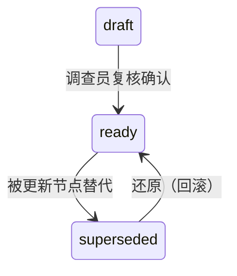

# 证据链与调查底稿管理

调查工作的"产品线" — 从原始证据到可呈堂的调查底稿。

## 配置前置检查

在执行本技能的业务操作前，按以下流程检查用户配置：

```
检查 ~/.claude/plugins/config/cc-investigation/team-profile.md
├── 不存在 / 含 [PLACEHOLDER] / 含 PAUSED 标记
│   └── 停止操作，提示: "请先运行 /cc-investigation:cold-start-interview 完成设置"
└── 配置就绪 → 继续

检查 ~/.claude/plugins/config/cc-investigation/evidence-policy.md
├── 不存在或含标记 → 使用内置默认值（不阻塞）
└── 就绪 → 读取密级体系、保管链要求等配置
```

详细规则参见 `config-templates/config-loader.md`。

此技能读取的配置项：
- team-profile：调查团队、证据存储路径（待后续实现）
- evidence-policy：密级体系、保管链要求、底稿质量标准

## When to Activate

- 收集和保全任何类型的证据
- 建立或维护证据链式保管记录
- 评估证据的可采性和证明力
- 编制调查工作底稿
- 复核他人的调查底稿
- 准备证据移交或归档

## 证据管理全生命周期

```
识别 → 收集 → 保全 → 记录 → 分析 → 保管 → 呈现 → 归档/移交
```

## 证据分类

### 按形式分类
| 类型 | 例子 | 保全要点 |
|------|------|---------|
| 书证 | 合同、发票、账册、审批单 | 原件优先；复印件标注来源 |
| 电子证据 | 邮件、聊天记录、系统日志、数据库 | 镜像复制；哈希值校验；metadata保全 |
| 物证 | 设备、文件实物、物品 | 封装标记；防止污染 |
| 证人证言 | 访谈记录、书面陈述 | 签字确认；录音佐证 |
| 视听资料 | 监控录像、电话录音 | 原始格式保存；防止剪辑 |
| 专家意见 | 鉴定报告、分析报告 | 鉴定人资质证明 |

### 按证明力分类
- **直接证据：** 单独即可证明核心事实（如签字的合同）
- **间接证据/旁证：** 需结合其他证据推断（如某人出现在现场的记录）
- **佐证证据：** 辅助证明其他证据的可信度（如证人品行证明）

## 链式保管 (Chain of Custody)

这是证据管理中**最关键**的环节 — 每一件证据的"身份证"和"护照"。

### 保管链包含的信息
```
证据编号：E-2024-001
证据描述：张三与李四2024年1月微信聊天记录导出文件 wechat_export_20240115.zip
提取人：王五 (调查员，工号 INV-032)
提取时间：2024-01-15 14:30
提取方式：从张三工作手机（IMEI: 123456789）使用 UFED 提取
哈希值 (MD5)：a1b2c3d4e5f6...
保管人：王五 → 赵六 (2024-01-15 17:00 移交证物室)
保管位置：证物柜 A-12，温度 22°C
移交记录：[每次经手人签名 + 时间 + 用途]
最终处置：2024-06-01 退回 IT 部门
```

### 保管原则
1. **最少经手人** — 链条越短越好
2. **每次交接必签名** — 双人见证
3. **封存完好** — 拆封需记录理由
4. **电子证据加哈希** — 任何处理前后验证完整性
5. **环境可控** — 防水、防火、防磁、防篡改

## 证据可采性评估框架

```
证据是否与待证事实相关？
  ├── 是 → 继续
  └── 否 → 排除
         ▼
证据是否合法取得？
  ├── 是 → 继续
  └── 否 → 评估是否可补救 / 排除
         ▼
证据是否可靠/真实？
  ├── 是 → 继续
  └── 否 → 寻找佐证 / 降低权重
         ▼
证据是否最优证据？
  ├── 是 → 可采纳
  └── 否 → 是否满足例外条件？→ 可采纳但说明理由
```

### 证据充分性判断（SPIRIT 框架）
- **S**ufficient — 数量是否足以排除合理怀疑？
- **P**ertinent — 是否直接相关于待证事实？
- **I**ndependent — 是否有独立来源相互印证？
- **R**eliable — 来源和保管过程是否可靠？
- **I**ntegrity — 完整性是否受到保护？
- **T**imeliness — 是否及时收集？

## 调查底稿管理

### 底稿分类
| 类别 | 内容 | 示例 |
|------|------|------|
| **管理类底稿** | 案件管理记录 | 立案申请表、调查计划、进度报告 |
| **证据类底稿** | 证据记录与分析 | 证据清单、链式保管表、鉴定委托书 |
| **分析类底稿** | 分析与推理记录 | 数据分析报告、流程图、资金追踪图 |
| **程序类底稿** | 程序执行记录 | 访谈记录、外勤记录、勘验笔录 |
| **结论类底稿** | 调查结论依据 | 调查发现汇总、结论依据分析、建议 |

### 底稿编制规范 (ALCOA 原则)
适用于调查底稿，源自药品数据管理规范但完全适用于调查场景：

- **A**ttributable — 可追溯：谁做的、何时做的
- **L**egible — 清晰可读：字迹/排版清晰
- **C**ontemporaneous — 同步记录：工作完成后立即记录
- **O**riginal — 原始/复制件标注清楚
- **A**ccurate — 准确无误：数据准确、无修改不留痕

### 底稿复核清单
- [ ] 底稿索引编号完整
- [ ] 每项发现都有对应证据支持
- [ ] 证据来源清楚、保管链完整
- [ ] 分析逻辑清晰、推理过程可追溯
- [ ] 结论与证据之间无逻辑跳跃
- [ ] 交叉引用标记正确
- [ ] 保密标记、密级标注
- [ ] 编制人、复核人、日期齐全


---

## 数据结构：evidence_registry.json

证据注册表是案件证据的结构化核心登记文件。精确的字段约束见 `schemas/evidence-registry.schema.json`，以下为本 skill 管理的字段说明。

**用途**：作为全案件节点的可发现性入口（chain_nodes 索引）和结构化摘要（entities、evidence_items、findings、hypotheses、event_timeline）。**不包含关系图**——节点之间的推导关系（谁支撑谁、谁反驳谁）由 `nodes/` 目录中各节点文件的 frontmatter 声明，二者通过 ID 空间（EV-/LS-/ARG-/FND- 等前缀）关联。

**JSON Schema**：`schemas/evidence-registry.schema.json`

**创建时机**：INIT 阶段与 meta.json、checklist.yaml 同时创建基础结构。INIT 阶段填写 metadata、chain_nodes（初始节点索引）、提取 entities、登记举报线索为首条证据条目、生成初始 hypotheses。PRE_INVESTIGATION 起追加实质性证据。FIELDWORK 阶段大量追加。REVIEWING 阶段冻结。

### 顶层结构

```json
{
  "metadata":       { "case_id", "generated_at", "last_updated" },
  "chain_nodes":    [ ... ],    // 节点索引（INIT 阶段创建，持续追加）
  "entities":       [ ... ],    // 涉案实体（人员/公司/项目/设备等）
  "evidence_items": [ ... ],    // 证据条目（核心数组，持续追加）
  "findings":       [ ... ],    // 事实认定（REVIEWING 阶段定型）
  "hypotheses":     [ ... ],    // 竞争假设（INIT 阶段生成，持续更新）
  "event_timeline": [ ... ]     // 事件时间线（AI 自动提取，贯穿全案）
}
```

### entities — 涉案实体

| 字段 | 必填 | 说明 |
|------|------|------|
| `entity_id` | ✓ | 格式 `ENT-NNN`，全局递增 |
| `entity_type` | ✓ | 枚举：subject（人员）、organization（组织）、project（项目）、account（账户）、device（设备）、other |
| `name` | ✓ | 实体名称 |
| `role` | — | 在案件中的角色（如 sales_rep、agent_owner、manager 等，由领域场景自定义） |
| `attributes` | — | 扩展属性对象，不同 entity_type 有不同属性集合 |

证据保管链中的实物证据持有人、电子证据提取对象，应登记为 entities 后通过 `related_entities` 关联。

### evidence_items — 证据条目

每条证据独立登记。证据的详细分析、提炼和关系声明由 `nodes/EV-NNN.md` 承载。此数组仅保留注册层信息（不含关系字段——关系见 nodes/ 中各文件的 relations 字段）。

| 字段 | 必填 | 说明 |
|------|------|------|
| `evidence_id` | ✓ | 格式 `EV-NNN`，全案全局递增 |
| `type` | ✓ | 枚举：system_data（系统数据）、documentary（书证）、digital_forensics（数字取证）、testimonial（证言）、physical（物证）、expert_opinion（专家意见）、state_transition_decision（状态转换决策） |
| `subtype` | — | 类型子分类，由领域场景自定义。如 documentary → contract、invoice |
| `summary` | ✓ | 证据摘要 |
| `source` | — | 证据来源说明 |
| `collected_by` | — | 收集人 |
| `collected_at` | ✓ | 收集时间 |
| `location` | — | 存储位置，推荐格式 `raw/EV-NNN.<ext>` |
| `hash` | — | 电子证据哈希值（SHA-256 推荐） |
| `confidence` | — | 证据置信度：confirmed / probable / suspected（默认 probable） |
| `probative_value` | — | 证明力：high / medium / low |
| `scoring_category` | — | 意图评分分类。用于 REVIEWING 阶段计算涉案人员意图评分。枚举值详见 `schemas/evidence-registry.schema.json`，评分框架见 `case-management/references/intent-scoring.md`。FIELDWORK→REVIEWING 前由 evidence-analyzer 填写。 |
| `related_entities` | — | 关联的实体 ID 列表 |

**对抗行为记录**：对 testimonial 类型的证据，在 `interview_metadata` 中记录对抗行为：

| 字段 | 说明 |
|------|------|
| `adversarial_flags` | 标记类型：虚假配合 / 选择性配合 / 编造性拒绝 / 经验性回避 |
| `statement_quality` | 清晰度：high / medium / low |
| `coherence` | 连贯性：high / medium / low |
| `major_defenses` | 主要辩解内容摘要 |

### findings — 事实认定

每条 finding 代表一个已确认或待确认的事实命题。完整推理记录和关系声明由 `nodes/FND-NNN.md` 承载。此数组仅保留结构化摘要。

| 字段 | 必填 | 说明 |
|------|------|------|
| `finding_id` | ✓ | 格式 `FND-NNN`，全案全局递增 |
| `statement` | ✓ | 事实陈述 |
| `fraud_type` | — | 关联的舞弊类型 |
| `main_dispute_points` | — | 关键争议点 |
| `alternative_explanations` | — | 已识别的替代解释及其处理状态（open/rejected/retained） |
| `defense_response_summary` | — | 对主要辩解的回应总结 |
| `confidence` | ✓ | 置信度：confirmed / probable / suspected |

**confidence 设计规则：**

| 置信度 | 含义 | 推进影响 |
|--------|------|---------|
| confirmed | 强有力且直接的证据支撑，可直接定性 | 正常推进 |
| probable | 基于现有证据的合理推论 | 正常推进 |
| suspected | 存疑，需要补充证据后才能定性 | 触发 REVIEWING→FIELDWORK 回退 |

**归因缺口的特殊处理**：当关键证据无法获取时，需在证据条目的 `source` 和 `confidence` 中反映缺口归因：

- **调查方缺口**（调查员技术/权限原因无法获取）→ 降低 finding 的 confidence
- **被调查方缺口**（被调查方无法/拒绝提供）→ 不降低 confidence，作为独立风险信号记录

缺口归因的判断方法参见 [`skills/investigation-foundation/SKILL.md`](../investigation-foundation/SKILL.md)。

有关 finding 的详细推理（inference_path、warrant、alternative_ruled_out、remaining_doubt 等），见 `nodes/FND-NNN.md` 模板中的对应章节。

---

### hypotheses — 竞争假设

假设驱动调查的核心数据结构。由 `investigation-planner` 在 INIT 阶段从线索提炼生成，随证据积累持续更新。

| 字段 | 必填 | 说明 |
|------|------|------|
| `hypothesis_id` | ✓ | 格式 `HYP-NNN`，全案全局递增 |
| `statement` | ✓ | 假设陈述 |
| `confidence` | — | 置信度 0-1，AI 在新证据登记后自动重估 |
| `status` | ✓ | active / rejected / confirmed |
| `alternative_hypotheses_addressed` | — | 本假设已回应的竞争假设 ID 列表 |
| `last_updated_at` | — | 最后更新时间 |
| `last_updated_by` | — | 最后更新者（agent 名称或调查员） |

**交互机制**：

| 触发点 | 执行者 | 动作 | 人工介入 |
|--------|--------|------|---------|
| INIT 立案 | investigation-planner | 从线索提炼 2-3 个竞争假设，写入 hypotheses | AI 生成后可手动修改 |
| 新证据登记 | evidence-analyzer | 更新 HYP-NNN.json 的 relations（supported_by/contradicted_by） | ◉ 自动，无需介入 |
| 假设置信度重估 | investigation-planner | 基于证据变化重新计算 confidence | △ 仅当跨越阈值(>0.8/<0.2)时确认 |
| 假设状态变更 | investigation-planner | active → rejected / confirmed | ✦ 必须手动确认 |

**关键规则**：
- 至少包含 1 个反向假设（如"举报不真实"）
- 所有假设在 INIT 阶段**同等优先级**验证，不得偏袒任一方向
- `status` 变更为 `confirmed` 或 `rejected` 仅限 REVIEWING 阶段，需调查员手动确认

---

### event_timeline — 事件时间线

被调查对象的行为时间序列（非调查活动日志）。由 AI 在登记每条新证据时自动从证据内容中提取时间信息并追加。关系（事件关联的证据）仅由 nodes/EVT-NNN.json 的 relations 字段声明。

| 字段 | 必填 | 说明 |
|------|------|------|
| `event_id` | ✓ | 格式 `EVT-NNN`，全案全局递增 |
| `title` | ✓ | 事件标题（一句话，如"供应商中标华东项目"） |
| `moment` | ✓ | 时间锚点。精确日期用 YYYY-MM-DD，模糊时间用最佳估计 |
| `time_type` | ✓ | 时间确定度：exact / range / approximate / inferred |
| `time_range` | — | 当 time_type=range 时的起止时间 [start, end] |
| `description` | — | 事件描述 |
| `inferred` | — | 是否为根据已知事件推测的补充事件（默认 false） |
| `inference_basis` | — | 推测依据（仅 inferred=true 时填写） |
| `tags` | — | 事件标签（如 contract、payment、interview），用于按主题筛选 |

**重建流程**（三步，全自动 + 可选人工）:

```
Step 1 — 提取（自动）
  登记新证据 → AI 扫描其中的时间信息 → 生成 EVT-NNN 事件条目
  └── 零人工成本，AI 在登记证据时同步完成

Step 2 — 排序与融合（自动）
  所有事件按 moment 排序 → 同一天事件自动分组
  → 检测到时间矛盾时并排显示并标记 ⚠
  └── AI 自动完成，仅矛盾时推送通知

Step 3 — 补缺推断（半自动）
  检测到事件链缺口 → AI 提示推测事件 → 调查员点击"同意"/"忽略"/"手动补充"
  └── 用户仅需做选择题，推理由 AI 完成
```

**事件时间线 vs 调查日志**：`event_timeline` 记录被调查对象的行为轨迹（"他做了什么、何时做的"），`case_memory/` 目录下的文件记录调查者的活动（"我们做了什么、何时做的"），两者在 REVIEWING 阶段共同支撑最终报告。

---

### 与 meta.json 的关系

evidence_registry.json 与 meta.json 通过 `case_id` 关联。meta.json 负责案件级元数据（状态、创建时间、SLA），evidence_registry.json 负责证据级数据（证据条目、实体、事实认定）。

参见 [`docs/case-data-model.md`](../../docs/case-data-model.md) 了解两个文件的创建顺序。

---

## nodes/ 目录 — 分析推理层

`nodes/` 目录承载证据链的推理分析层。与 `evidence_registry.json` 通过 ID 空间关联，关系声明仅存在于各节点文件的 frontmatter 中，不在 JSON 中维护副本。

### 目录规则

```
cases/CASE-NNNN/
├── nodes/                     ← 所有节点扁平存放，不按类型分子目录
│   ├── EV-001.json            ← 结构化数据用 JSON
│   ├── LS-001.md              ← 叙事型分析用 markdown
│   ├── ARG-001.md
│   ├── FND-001.md
│   ├── ENT-001.json
│   ├── HYP-001.json
│   └── EVT-001.json
├── evidence_registry.json     ← 索引（chain_nodes）+ 结构化摘要
└── raw/                       ← 原始文件（PDF、截图），图外
```

**关键规则**：

| 规则 | 含义 |
|------|------|
| 类型在 frontmatter | 不按节点类型分子目录——线索可能升格为论据，搬文件会断引用 |
| 关系在节点内 | relations（derived_from/supports/contradicts 等）仅在节点文件的 frontmatter 中声明，不另造边文件 |
| JSON 只做索引 | evidence_registry.json 的 chain_nodes 仅记录 ID、type、status，不做关系副本 |
| ID 不可变 | EV-ID 一旦注册永不改变。派生证据用新 EV-ID，`supersedes` 字段标注来源 |

### 节点类型总览

| 前缀 | 类型 | 文件格式 | 存储位置 | 生命周期 |
|------|------|----------|----------|---------|
| `EV-` | evidence | JSON（结构化） | `nodes/EV-NNN.json` | 注册→冻结 |
| `LS-` | clue | MD（叙事型） | `nodes/LS-NNN.md` | draft→ready→superseded |
| `ARG-` | argument | MD（叙事型） | `nodes/ARG-NNN.md` | draft→ready→superseded |
| `FND-` | finding | MD（叙事型） | `nodes/FND-NNN.md` | draft→ready→superseded |
| `ENT-` | entity | JSON（结构化） | `nodes/ENT-NNN.json` | 注册→冻结 |
| `HYP-` | hypothesis | JSON（结构化） | `nodes/HYP-NNN.json` | active→rejected/confirmed |
| `EVT-` | event | JSON（结构化） | `nodes/EVT-NNN.json` | 追加→冻结 |

### 状态机



**关键规则**：
- AI 可以创建和编辑 `draft` 节点
- `draft → ready` **仅限调查员操作**（AI 不能批准自己生成的内容）
- `finding` 节点仅当 derived_from 链中所有节点均为 `ready` 时才能转为 `ready`
- `superseded` 节点保留文件，添加 `supersedes` 字段指向替代节点，不删除

### 关系声明

所有关系通过各节点文件 frontmatter 中的 `relations` 命名空间字段声明。每条关系按语义类型分组，不再使用通用 `sources` 字段。

```yaml
# nodes/LS-001.md —— 完整示例
relations:
  derived_from:
    - id: EV-001
      excerpt: "设备在广州激活"
      form: data
    - id: EV-004
      excerpt: "激活日志第12-18行"
      form: data
  supports:
    - ARG-001
  contradicts: []
  involves:
    - ENT-001
```

**6 种关系类型**：

| 关系类型 | 语义 | 方向 | 值格式 | 适用节点 |
|---------|------|------|--------|---------|
| `derived_from` | 推导自/来源于 | 本 → 上游 | 推荐详尽格式（id+excerpt+form） | EV, LS, ARG, FND, EVT |
| `supports` | 支撑/支持结论 | 本 → 下游 | 简洁格式（ID 列表） | LS, ARG, EVT |
| `contradicts` | 反驳/矛盾 | 本 → 目标 | 简洁格式 | EV, LS, ARG, FND, HYP |
| `involves` | 涉及实体 | 本 → ENT | 简洁格式 | EV, LS, ARG, FND, EVT, ENT |
| `corroborated_by` | 被印证 | 本 → EV | 简洁格式 | EV（仅） |
| `addresses` | 应对竞争假设 | 本 → HYP | 简洁格式 | HYP（仅） |

**值格式**：

```yaml
# 简洁格式（仅 ID 列表）——用于 suppports/contradicts/involves
supports: ["ARG-001", "ARG-002"]

# 详细格式（含 excerpt 引用）——用于 derived_from
derived_from:
  - id: EV-001
    excerpt: "设备在广州激活"
    form: data
```

**规则**：
- 关系只向下声明：每个节点声明自己的上游依赖，不维护"谁引用了我"的字段
- 反向追溯由 `scan-chain.py` 自动计算
- FND 的 `derived_from` 应为 ARG 节点，而非直接引用 EV 节点（`scan-chain.py --check-chains` 会检查此项）
- 矛盾关系通过 HYP 的 `contradicted_by` 或 LS/ARG 的 `contradicts` 字段显式处理
- `supports` 和 `contradicts` 不应指向同一个目标（`scan-chain.py --check-chains` 会警告冲突）

**excerpt 撰写规则**：
- excerpt 是流向事实（`"承认扩容虚构"`），不是文件元信息（`"王赞第三轮访谈笔录"`——那是来源属性）
- 可独立阅读的短语，不超过 25 字
- 跨类型推理（LS→ARG），可写"因 A+B → C"式组合
- excerpt 仅在 `derived_from` 类型中使用；`supports`/`contradicts`/`involves` 无需 excerpt

### 节点内容生成规范

节点文件（EV/LS/ARG/FND）的标题和正文遵循统一的撰写规则，确保在树状图、力导向图等可视化工具中"一眼看清"证据链的因果和逻辑关系。

**title 断言公式**


title 即断言。每条 title 必须是一个可直接读出的判断，不含描述过程词和元信息前缀。

| 类型 | 断言公式 | 说明 | 好示例 | 差示例 |
|------|---------|------|--------|--------|
| EV | `谁 + 动作 + 事实` | 主体行为+核心事实，整句 | `王赞供述: 扩容虚构` | `王赞承认项目名称扩容是虚构的正常名称应是奥飞200G网卡采购` |
| LS | `断言事实` | 直接陈述事实本身 | `项目名称纯属虚构` | `项目名称虚构确认`（"确认"是动作） |
| ARG | `可推断: 局部结论` | 推理结论，不写论证过程 | `已构成假单申报` | `项目虚构的逻辑论证`（"逻辑论证"是元信息） |
| FND | `行为 + 违规类型` | 可直接写入报告的事实认定 | `虚假项目申报假单` | `王赞虚构项目名称申报假单`（含主体，treemap 框内显示不全） |
| HYP | `可能: 假设陈述` | 以可能性开头的假设 | `举报存不实动机` | `HYP-001`（无信息量） |
| EVT | `时间 + 事件` | 事件标识 | `5月第三轮访谈` | `EVT-003`（无信息量） |
| ENT | `角色: 名称` | 实体标识 | `经办人: 邓富星` | `ENT-002`（无信息量） |

**原则**：
- title 不含"结论："、"证据："、"论证："等元信息前缀——类型已由 `FND-` `EV-` `ARG-` 等前缀写明
- title 不含论证过程、不含上下文背景
- EV 类型如需在 treemap 上承载一句完整陈述，使用 `summary` 字段补充（已有字段）

**body 写作规范**


每类节点的正文由一组强制章节构成。每个章节有明确的写作意图，不得省略、合并或替换。

| 类型 | 强制章节 | 各章节意图 |
|------|---------|-----------|
| EV | `关键内容摘要` | 证据中提取的事实片段——让读者直接看到证据说什么 |
| | `使用说明` | 证据的限制、可信度、关联线索——让读者知道怎么用这份证据 |
| LS | `关键发现` | 从原始证据中提炼的核心事实——表格优先，每条发现标注来源 EV-ID |
| | `下一步` | 还需要什么补充证据或分析——让调查方向和缺口可见 |
| ARG | `推理前提` | 从 LS 到结论的推演步骤——分前提列出，每步标注引用 |
| | `剩余怀疑` | 尚未排除的替代解释或不确定性——不可省略；写"无"也保留章节 |
| FND | `推理路径` | 图示化呈现从 EV 到 FND 的完整链路——标识每条支撑线的走向 |
| | `推理依据` | 最终认定的逻辑推导——从支撑论据到结论的完整说理 |
| | `剩余怀疑` | 仍然存在的不确定性——关乎结论可被攻击的弱点 |
| ENT | 正文非必须 | 结构化数据在 frontmatter 中表达即可 |
| HYP | 正文非必须 | 同上 |
| EVT | 正文非必须 | 同上 |

**title 与 body 的衔接**：

> title 是断言，body 是支持该断言的完整材料。
> body 的第一章必须与 title 呼应——让读者读完第一章（约 3-5 行）就知道 title 的结论从何而来。

每份 body 的三个自检标准：

1. **完整性**：拟审理人员读完 body 后，能否不依赖其他材料理解该节点的全部信息？→ 不能则遗漏
2. **精炼性**：去掉任意一段是否无损于读者理解？→ 能则那段是废话
3. **可追溯性**：body 中每个 claim 是否标注了来源 ID？→ 否则补充引用

excerpt 是"流向下一级的事实"——告诉下游节点/读者这段关系承载的具体内容。

**原则**：
- excerpt 是流向事实，不是文件元信息
  - ✅ `承认扩容虚构`（从 EV-001 流向 LS-001 的关键事实）
  - ❌ `王赞第三轮访谈笔录`（那是来源属性，不是流向事实）
- excerpt 应为一个可独立阅读的短语，不超过 25 字
- 跨类型推理（LS→ARG），excerpt 可写"因 A+B → C"式组合
- 当前 `relations.derived_from` 已支持 `id` / `excerpt` / `form` 三个子字段

### 创建节奏

| 阶段 | 节点操作 |
|------|---------|
| **INIT** | 在 evidence_registry.json 注册 EV-001（举报线索），创建初始 ENT/HYP 节点 |
| **PRE_INVESTIGATION** | 追加 EV 节点，创建 LS 节点做线索分析 |
| **FIELDWORK** | 大量追加 EV（访谈/调证），创建 ARG 节点构建论据 |
| **REVIEWING** | 创建 FND 节点做事实认定，冻结所有节点 |

### 使用示例

```bash
# 创建线索节点
> id: LS-003 | type: clue | status: draft | title: "跨区激活异常" | relations: {derived_from: [EV-001, EV-004], supports: [ARG-001]}

# 升格为论据（不改文件路径，只改 frontmatter）
> id: ARG-001 | type: argument | status: draft | proposition: "激活记录证明跨区销售" | relations: {derived_from: [LS-001, LS-003], supports: [FND-001]}

# 记录结论
> id: FND-001 | type: finding | status: draft | confidence: probable | relations: {derived_from: [ARG-001]}
```

### 模板参考

各节点类型的 frontmatter 模板位于 `project-templates/default/nodes/`：
- `EV-NNN.md` — 证据节点模板
- `LS-NNN.md` — 线索节点模板
- `ARG-NNN.md` — 论据节点模板
- `FND-NNN.md` — 事实认定模板
- `ENT-NNN.md` — 实体模板
- `HYP-NNN.md` — 假设模板
- `EVT-NNN.md` — 事件模板

---

## 分析辅助工具

以下工具类型可辅助加速证据管理操作。**这些工具不是必须的**——未配置时，由模型按证据管理标准直接完成。

如环境中配置了以下类型的 MCP 服务器，可辅助加速。不可用时由以下替代方式完成：
- **文件系统操作类 MCP**：用于读取/搜索证据文件、整理目录结构。不可用时手动指定文件路径
- **文档分析类 MCP**：用于提取 PDF 文本、搜索文档关键词、对比文件版本。不可用时直接阅读文件
- **数据库查询类 MCP**：用于查询证据登记表、检索底稿索引。不可用时查阅登记表或 CSV

**工作流示意（流程固定，工具可选）：**
1. 收集案件证据文件列表（由文件系统类 MCP 辅助或手动指定路径）
2. 提取关键文档摘要（由文档分析类 MCP 辅助或直接阅读文件）
3. 查验证据登记信息（由数据库类 MCP 辅助或查阅登记表）
4. 整合数据 → 生成证据清单底稿


## Related

- **Skills:** [调查哲学与方法论](../investigation-foundation/SKILL.md), [写作与报告技巧](../writing-reporting/SKILL.md), [访谈与问话分析](../interview-analysis/SKILL.md)
- **Rules:** [证据规则](../../rules/evidence-rules.md), [底稿标准](../../rules/working-paper-standards.md)
- **Agents:** `evidence-analyzer` for 证据评估, `case-manager` for 底稿复核
- **Commands:** `/evidence` 证据管理, `/chain-of-custody` 保管链, `/working-paper` 底稿操作

## References
- ACFE "Fraud Examiners Manual" — Evidence Chapter
- SWGDE "Best Practices for Digital Evidence"
- ISO 27037:2012 — Guidelines for identification, collection, acquisition and preservation of digital evidence
