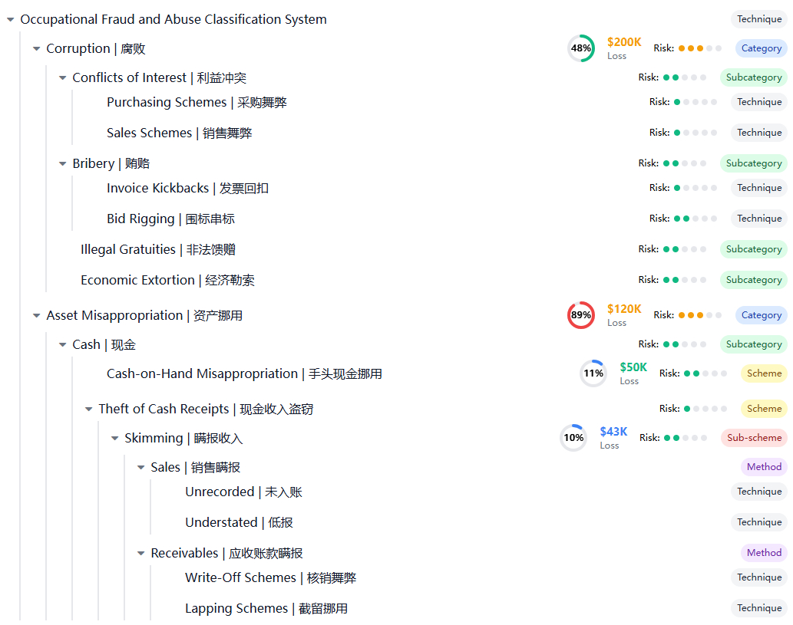

# 舞弊分类 — 个人工作手册

面向：正在使用 fraud-classification 技能进行案件分类的调查员。
目的：自己看的速查手册。理解 ACFE 分类框架、掌握技能调用方法、学会适配企业自有分类体系。

***

## 一、关于分类，记住这三句

1. **选对分类就是选对路径。** 资产侵占、财务造假、腐败贿赂三大类的调查手段差异巨大——把采购舞弊当费用报销查，从一开始就偏了。
2. **分类不是贴标签，是路由。** 本技能的核心功能是：输入线索信号 → 匹配 ACFE 舞弊类型 → 路由到对应的 `fraud-<domain>` 场景技能。分类的目的是找到正确的调查方案，不是为了归档。
3. **企业分类 ≠ ACFE 分类。** ACFE 是理论框架，企业内部可能有自己的分类口径（按部门、按系统、按损失金额等）。本技能可以适配你的企业口径——详见下文。

***

## 二、技能调用方式

### 方式一：通过代理自动分类（推荐）

由 `fraud-type-classifier` 代理自动完成。当你描述案件线索时，代理会：

1. 分析线索信号特征
2. 匹配最可能的舞弊类型
3. 路由到对应的 `fraud-<domain>` 场景技能
4. 输出分类理由和置信度

**入口：** `/cc-investigation:fraud-type` 或直接向 Claude 描述案情。

### 方式二：直接调用本技能

> 我需要判断以下线索属于什么舞弊类型：\[描述线索]
> 请基于 fraud-classification 进行分类，并推荐对应的调查技能。

### 方式三：手动查阅 SKILL.md

直接阅读 `SKILL.md` 中的分类全景图和调查手段矩阵，了解各类型差异后自行判断。

### 典型工作流位置

```
线索输入
  └→ fraud-classification 分类 → 明确属于哪类舞弊
      └→ investigation-planner 设计方案
          └→ fraud-<domain> 场景技能 + data-analysis + interview-analysis
              └→ evidence-management 登记
                  └→ report-writer 输出
```

***

## 三、分类框架全景

本技能基于 **ACFE（注册舞弊审查师协会）** 的职业舞弊分类体系，将舞弊分为三大主类和若干子类。



**报告引用格式：** ACFE, "Occupational Fraud 2026: A Report to the Nations" (2026).

### 专题舞弊类型（扩展分类）

以下场景在 ACFE 框架基础上进行了领域细化，每个场景有独立的 `fraud-<domain>` 技能：

| 类型     | 对应技能                          | 说明                 |
| ------ | ----------------------------- | ------------------ |
| 渠道舞弊   | `fraud-channel`               | 窜货、假终端客户、成本造假、拼单绑单 |
| 费用报销舞弊 | `fraud-reimbursement`         | 虚构、篡改、重复报销、性质篡改    |
| 采购舞弊   | `fraud-procurement`           | 围标串标、虚假供应商、虚假收货    |
| 投标操纵   | `fraud-bid-rigging`           | 压标、陪标、轮标、市场划分      |
| 知识产权舞弊 | `fraud-ip`                    | 商业秘密窃取、竞业违规、专利侵权   |
| 人力资源舞弊 | `fraud-hr`                    | 虚假员工、薪资操纵、招聘舞弊     |
| 伪造印章   | `fraud-fake-chop`             | 私刻、变造、盗用、冒用        |
| 利益冲突   | `fraud-conflicts-of-interest` | 采购冲突、销售冲突、裙带关系     |

***

## 四、适配企业内部分类

每个企业都有自己的一套"黑话"和分类口径。本技能默认使用 ACFE 标准框架，但你可以调整让它听懂你们公司的语言。

### 场景一：你们有自己的舞弊分类代码

比如贵司把舞弊分为：A01（资金侵占）、A02（存货盗用）、B01（商业贿赂）……

**做法：** 在 `team-profile.md` 中声明映射关系：

```markdown
## 企业舞弊分类与 ACFE 映射

| 公司分类代码 | 公司分类名称 | 对应 ACFE 类型 |
|------------|------------|--------------|
| A01 | 资金侵占 | Asset Misappropriation - Cash |
| A02 | 存货盗用 | Asset Misappropriation - Inventory |
| B01 | 商业贿赂 | Corruption - Bribery |
| B02 | 采购回扣 | Corruption - Kickbacks |
| C01 | 收入造假 | Financial Statement Fraud - Revenue |
```

每次分类时，AI 会同时输出 ACFE 类型和对应的公司分类代码。

### 场景二：你们按部门/系统分类

比如 "供应链中心案件"、"销售部案件"、"研发部案件"……

**做法：** 同样在 `team-profile.md` 中声明：

```markdown
## 部门分类与舞弊类型映射

| 部门 | 高频舞弊类型 |
|------|------------|
| 销售部 | 渠道舞弊、费用报销舞弊 |
| 采购部 | 采购舞弊、腐败贿赂 |
| 财务部 | 财务造假、费用报销舞弊 |
| 研发部 | 知识产权舞弊、HR 舞弊（招聘环节） |
| 生产部 | 资产侵占（存货挪用）、采购舞弊 |
```

### 场景三：你们按损失金额分级

| 损失金额         | 级别   | 调查策略       |
| ------------ | ---- | ---------- |
| < 10 万       | 常规   | 单一路径调查     |
| 10 万 - 100 万 | 重点关注 | 多路径交叉验证    |
| > 100 万      | 重大   | 专案组 + 外部资源 |

### 场景四：案件类型不对应一个分类

案件往往涉及混合类型——比如渠道舞弊中可能同时有利益冲突和费用报销舞弊。

**做法：** 在案件中声明多分类标记，AI 会按"主类型 + 关联类型"的方式处理。

***

## 五、新增场景技能时，同步更新本技能

当你创建了一个新的 `fraud-<domain>` 场景技能（如 `fraud-healthcare`），必须同时更新本技能，否则分类器不知道有这个新类型。

### 需要修改什么

| 位置       | 文件                           | 操作                   |
| -------- | ---------------------------- | -------------------- |
| 专题舞弊类型索引 | `SKILL.md`                   | 在"专题舞弊类型索引"表追加一行     |
| 参考资源     | `README.md`（本文件）             | 在"专题舞弊类型"表追加一行（见第三节） |
| ACFE 映射  | 如有必要，在 team-profile.md 中补充映射 | <br />               |

### 新增后验证

> 提示：我遇到一个 \[描述新场景的线索] — 应当分类到 fraud-healthcare
>
> 预期：AI 正确识别并推荐 fraud-healthcare 技能

***

## 六、与 AI 协作的技巧

### 分类时告诉 AI

> 这个案件的线索是 \[描述]。请分类到 ACFE 类型，同时告诉我对应的公司分类代码（参考 team-profile.md）。

### 混合类型时

> 请按主类型和关联类型分别标记，主类型确定调查路径，关联类型确定需要调用的其他技能。

### 定期核对分类准确性

建议每季度回顾已结案件的分类标签，检查：

- 是否有新出现的舞弊手法没有对应类型
- 是否有某些类型长期未被使用（可能需要激活或合并）
- 是否有线索被误分类到错误类型

### 不确定时

如果线索模糊、无法确定类型，AI 会输出"待定"并提供需要补充的信息。不要强行塞一个分类——错误的分类会导致调查方案跑偏。

***

## 七、参考资源

| 资源          | 位置                                                                       | 用途                    |
| ----------- | ------------------------------------------------------------------------ | --------------------- |
| ACFE 官方调查报告 | [acfe.com/report-to-the-nations](https://acfe.com/report-to-the-nations) | 损失估算、行业分布、基准数据        |
| 技能完整定义      | `SKILL.md`                                                               | 分类全景、各类型调查手段矩阵、手段选择矩阵 |
| 舞弊类型分类代理    | `agents/fraud-type-classifier.md`                                        | 自动分类的代理实现             |
| 企业配置        | `~/.claude/plugins/config/cc-investigation/team-profile.md`              | 企业分类映射、制度定义           |

