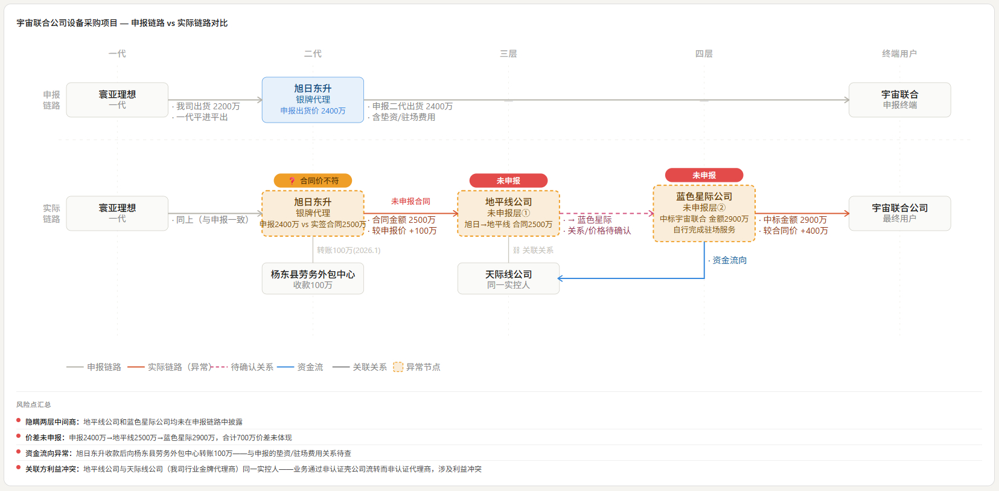

# 项目执行差异分析工具

快速对比"合同/系统里是怎么申报的"与"实际是怎么执行的"，把不一致的地方用一张图列出来。

调查中常说"查链路"——这个工具就是做链路对比的。适用于渠道窜货、采购舞弊、虚构交易等多种场景。

## 什么时候用

当你遇到以下情况时，可以让 AI 执行这个分析：

- 拿到了一份订单/合同，但怀疑实际执行方与合同载明的主体不一致
- 发现申报的渠道链条（一代→二代→终端）与实际签收/付款链条对不上
- 需要向团队或上级展示"哪里有问题"——图表比文字更直观
- 多个项目涉及同一代理商，需要横向对比差异模式

一句话：**凡是要比"纸上写的"和"实际干的"有什么不同，就用它。**

## 分析逻辑（三条流）

工具对比以下三个维度。不需要全都做，但做全了不会漏：

| 维度 | 比什么 | 怎么比 |
|------|--------|--------|
| **合同流** | 交易主体、链路层级、合同价格 | 申报的合同链 vs 实际签署的合同 |
| **货物流** | 发货去向、交付路径、设备激活 | 系统发货记录 vs 签收单/激活记录 |
| **资金流** | 交易金额、渠道利润、第三方费用 | 申报价格 vs 实际支付凭证 |

## 使用流程

### 你这边要做的事

1. 告诉 AI 你要分析哪个项目/订单
2. 回答 AI 的提问——它会按 `intake-form.md` 的清单逐项问你：
   - 链路有几层？每层叫什么？
   - 每层对应哪个公司？角色是什么？
   - 各环节的交易金额、利润率是多少？
   - 有哪些风险点需要标注？
3. 把回答给到 AI，它会生成一个 HTML 格式的链路对比图

### 你需要准备的材料

| 材料 | 用途 | 来源 |
|------|------|------|
| 订单/合同信息 | 填充申报链路数据 | 系统导出或合同文本 |
| 签收单/激活记录 | 填充实际执行数据 | 售后系统或纸质单据 |
| 付款凭证/发票链 | 资金流对比 | 财务系统或纸质凭证 |
| 第三方工商信息 | 核实主体真实性和关联关系 | 企查查/天眼查 |

## 产出物说明

AI 生成的是一个 **独立的 HTML 文件**，双击即可在浏览器打开，包含：

- **链路对比图**：申报链路 vs 实际链路的逐层对比，合同流/资金流用不同颜色区分
- **差异标注**：差异节点和差异边上会高亮显示
- **风险汇总面板**：图下方的风险点清单

> **查看方式**：保存为 `.html` 文件，用 Chrome/Edge/Firefox 等浏览器打开即可。不需要联网，不需要装任何软件。

## 使用注意事项

### ① 数据完整性决定分析质量

- 申报链路和实际链路的数据越完整，分析结论越可靠
- 关键数据（如合同金额、签收主体）尚不明确时，标注"待核实"即可，图上会以虚线显示
- 不要为了"看起来好看"填写未经核实的数据——差异分析的目的是暴露问题，不是粉饰

### ② 链路深度不一致是正常的

- 申报可能是"一代→终端"（2 层），实际可能是"一代→二代→三代→终端"（4 层）——这是常见情况
- 图上会自动补齐缺失层级，申报缺的层标注"未申报"，实际缺的层标注"未涉及"
- 这不是工具的 bug，恰恰是工具要帮你看出来的东西

### ③ 多维度关系需要区分标注

- 合同流（蓝色）、资金流（绿色）、货物流（紫色）、控制关系（玫红色）在图上用不同颜色区分
- 如果 A 卖给 B 有合同关系，同时 A 又给 B 转了一笔钱——这是两条不同的边，需要分别标注
- 告诉 AI"这是合同关系"还是"这是资金往来"即可，颜色/线型会自动匹配

### ④ 结果的用途

- 差异分析报告本身**不是最终证据**，它是指引——告诉你"哪里可能有问题，需要进一步取证"
- 发现的差异点可以（也应该）登记到 `evidence_registry.json` 作为正式证据链的一部分
- 建议将 HTML 报告归档到案件目录中（如 `03_FIELDWORK/`），作为调查底稿的一部分

### ⑤ 生成的图表是可迭代的——不要依赖 AI 单轮输出

- 生成 HTML 对比图后，你可以基于看到的图表继续和 AI 对话——哪里不够清晰、哪些信息多余、哪些标注需要调整
- 例如："把资金流的线条调细一点"、"隐藏合同流只看货物流"、"在图上加一个 XX 公司的关联关系标注"、"风险面板里把金额差异列到最前面"
- **这是最终输出质量的关键环节。** 单轮生成的图几乎永远需要微调——你的行业知识和对案件的熟悉程度决定了什么该突出、什么该省略
- 修改不需要重新填一遍 intake-form，直接在对话中说明改动即可，AI 会修改模板里的数据

> 常见做法：先让 AI 生成一版"完整版"（尽可能多放信息），然后逐步修剪、对齐、强调重点。与其一次性要求完美，不如快速出稿 + 迭代修改。

### ⑥ 一个常见误区

> "申报利润 2.9% → 实际利润 4.3%，差值 1.4% 看起来不多。"

差值 1.4% 乘以全年交易额可能就是数百万。不要只看百分比，关注**绝对金额**和**是否有未披露的利润去向**。

## 样例输出

下图为 CASE-2026-002 的实际输出——展示了 5 层链路对比（申报 4 层 vs 实际 5 层），包含合同流差异、资金流向和控制关系标注。

> 图中可见：申报链路（灰色实线）到二代为止，而实际链路（橙色实线）延续到三代和终端用户；隐藏链路（粉色虚线）连接了关联公司；下方风险汇总面板列出了各项差异。
